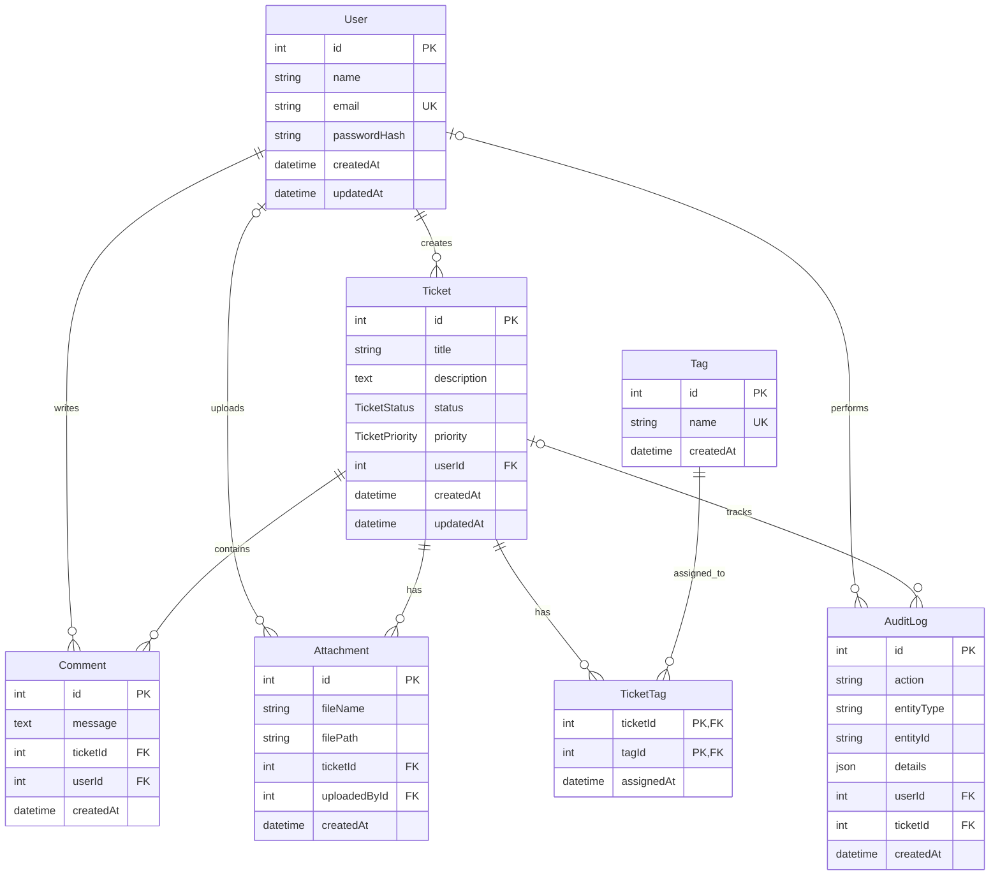

```mermaid
erDiagram
    User ||--o{ Ticket : creates
    User ||--o{ Comment : writes
    User o|--o{ Attachment : uploads
    User o|--o{ AuditLog : performs

    Ticket ||--o{ Comment : contains
    Ticket ||--o{ Attachment : has
    Ticket ||--o{ TicketTag : has
    Ticket o|--o{ AuditLog : tracks

    Tag ||--o{ TicketTag : assigned_to

    User {
        int id PK
        string name
        string email UK
        string passwordHash
        datetime createdAt
        datetime updatedAt
    }

    Ticket {
        int id PK
        string title
        text description
        TicketStatus status
        TicketPriority priority
        int userId FK
        datetime createdAt
        datetime updatedAt
    }

    Comment {
        int id PK
        text message
        int ticketId FK
        int userId FK
        datetime createdAt
    }

    Tag {
        int id PK
        string name UK
        datetime createdAt
    }

    TicketTag {
        int ticketId PK, FK
        int tagId PK, FK
        datetime assignedAt
    }

    Attachment {
        int id PK
        string fileName
        string filePath
        int ticketId FK
        int uploadedById FK
        datetime createdAt
    }

    AuditLog {
        int id PK
        string action
        string entityType
        string entityId
        json details
        int userId FK
        int ticketId FK
        datetime createdAt
    }
```
